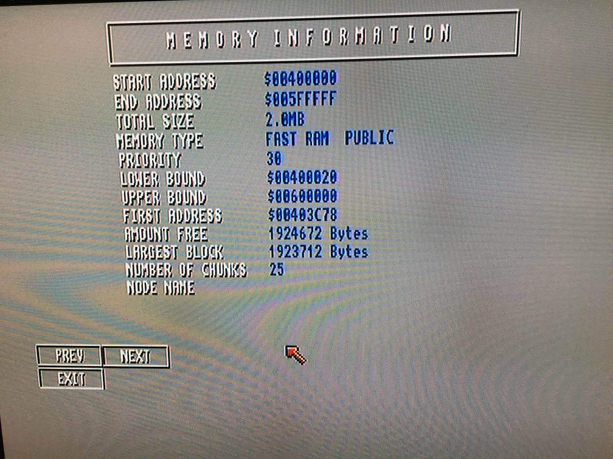

# Amiga 500 CPU Relocator with 2MB Fast SRAM
An Amiga 500 cpu relocator with 2mb sram, no autoconfig, use addmem to add memory in Z2 space

This one I did just for fun, wanted to see if I could add 2 MB fast mem to the amiga 500 with just combinatorial logic IC's. It works well but only runs in the standard 7 MHz speed since DTACK is generated by the normal Amiga bus cycle.

The 2MB can be placed in any of the 16-bit Zorro II space slots with addmem, the jumper needs to be set to any of the four base addresses and correspond to your addmem base address. The addmem command can be found on Aminet if you don't have it in C already.

    addmem 200000 400000
    addmem 400000 600000
    addmem 600000 800000
    addmem 800000 A00000

***

 
Testing the relocator with a TF530 that has 2 MB onboard ram. Setting the relocator ram as higher priority memory really slows down the accelelerator since it has to insert wait states to talk to the 7 MHz bus.
 

***

Here testing with a TF534 and adding ram at base $600000, works ok but really no need, this was just for fun....

